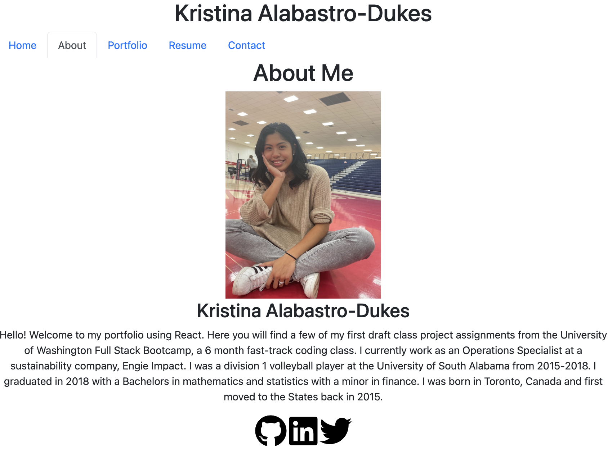

# Kristina Dukes React Portfolio

## Description

Welcome to my personal portfolio webpage built with React.js. Here you will find some information about me, the projects that I have completed as a UW Full-Stack Bootcamp Student, and a list of my skills. 

## Usage
To run the app in development mode: open up the integrated terminal and run `npm run start`

To use the deployed app, you use navigation bar to switch between the various pages: About Me, Portfolio, Resume, and Contact. You can also click on the below icons in the footer to be nagivated to my Github profile as well as my Linkedin profile.

## Link to Deployed Website

## Screenshot

## Resources 
* https://www.freecodecamp.org/news/build-portfolio-website-react/ 